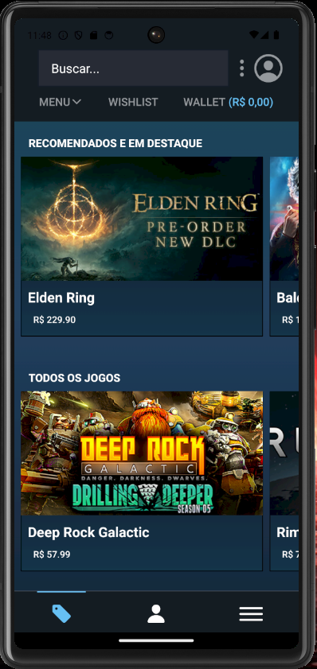

# React-Native-P1

## Índice

<ul>
    <li>Sobre o Projeto</li>
    <li>Tecnologias utilizadas</li>
    <li>Autor do Projeto</li>
</ul>

## Sobre o Projeto

Contexto: Aplicativo mobile com tema da Steam

- [Steam](https://store.steampowered.com/?l=portuguese)

O aplicativo mobile tem:
- Pagina de Login com verificação de credenciais.
- Pagina de Cadastro com verificação de erros e POST para API.
- Pagina de Home com GET para jogos inseridos no banco da API.
- Pagina de Profile.
- Nevegação utilizando Stack e Drawer.

API feita utilizando springboot e maven para:
- Cadastro e verificação de login.
- Banco de dados para jogos inseridos.

Exemplo Login:
<h3 align="center">
    
</h3>

Exemplo Cadastro:
<h3 align="center">
    
</h3>

Exemplo Home:
<h3 align="center">
    
</h3>

##  Tecnologias utilizadas

- [Visual Studio Code](https://code.visualstudio.com/)
- [GitHub](https://github.com/)
- [React Native](https://reactnative.dev/)
- [Springboot](https://spring.io/projects/spring-boot)

## Autor
- Bernardo Meira - https://github.com/BernardoMeira
